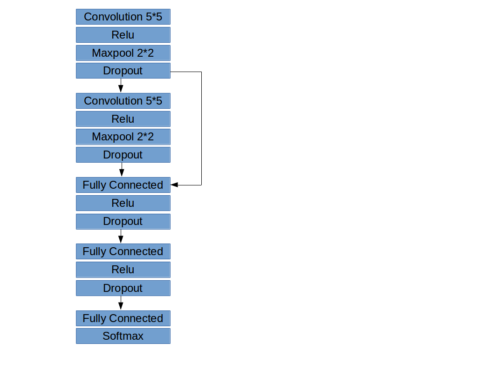

# SDCND Project Report: Build a Traffic Sign Recognition Classifier

## Abstract

This project uses deep convolutional nerual network to classify traffic sign images. Equipped with many techniques including data preporcessing, data augmentation, multi-scale deep convolutional nerual network, the model is able to achieve an accuracy of 97.4% on test data. 

## Dataset

The [German Traffic Sign Dataset](http://benchmark.ini.rub.de/?section=gtsrb) is a multi-class, single-image dataset consists of 39,209 32×32 px color images  for training, and 12,630 images for testing. Each image is a photo of a traffic sign belonging to one of 43 classes, e.g. traffic sign types. Each image has 3 color channels representing RGB channels respectively. Some sample images are shown below.

## Preprocessing

Create validation set. Deep learning models requires a dataset to validate the model's performance during traing, and this dataset must not be mingled with test dataset. Thus 30% training data is randomly selected as the validation dataset

According to [Sermanet et al.](http://yann.lecun.com/exdb/publis/pdf/sermanet-ijcnn-11.pdf), converting images to gray scale improves model performance. Therefore all dataset is converted to black and white. The preprocessed dataset is illustrated below.

## Data Augmentation

Image data can be manipulated to create more samples for the model to learn. In this project, multiple image augmentation techniques are implemented to create a balanced training dataset.
They are Rotating, shearing, translating, augmenting brightness of an image. Examples of the augmented images are given in the following picture.

For each class of the training data, augmented images are filled in to balance the dataset. Each class has 5000 training sets. Class distribution before and after filling augmented dataset are shown below.

**Before:**

**After:**

As a consequence, a training dataset of 215000 images is created with 27446 images original data and 187554 jittered images.

## Model

### Architecture
An illustration of the deep convolutional nerual network model is shown below. The model has 2 convolutional layers with maxpool and dropout operation to improve performance and reduce overfitting. Each convolutional layer is feeded to the final fully connected layers to capture muti-scale features.

### Regularization

L2 regularization is implemented to prevent overfitting, L2 loss of all weights is added to the general cost. Bias terms are not included since they are not contributing to overfitting.

### Early Stop

Another mesure to prevent overfitting is to implement early stop. In this model if the performance does not improve in 100 epochs then the training will be terminated.

## Training

Due to limited computation power, this project did not conduct parameter search to find the optimal parameters. However, the model has a relative good performance.

Parameters for training this model is listed in the table below.

| Parameter               | Value |
|-------------------------|-------|
| Batch size              | 128   |
| Epochs                  | 1000  |
| Learning rate           | 1e-4  |
| L2 regularization lamda | 1e-5  |
| Dropout rate            | 0.5   |

## Results

After 346 epochs, the early stopped model achieved an accuracy of 97.4% on the test dataset. Compared to 98.3% human performance, it can be considered as a relative good performance.

Apply this model to some new images, the model performed relative well on similar traffic signs.

## Appendix
Source code of the project is available at [https://github.com/hello2all/CarND-Traffic-Sign-Classifier-Project](https://github.com/hello2all/CarND-Traffic-Sign-Classifier-Project)
